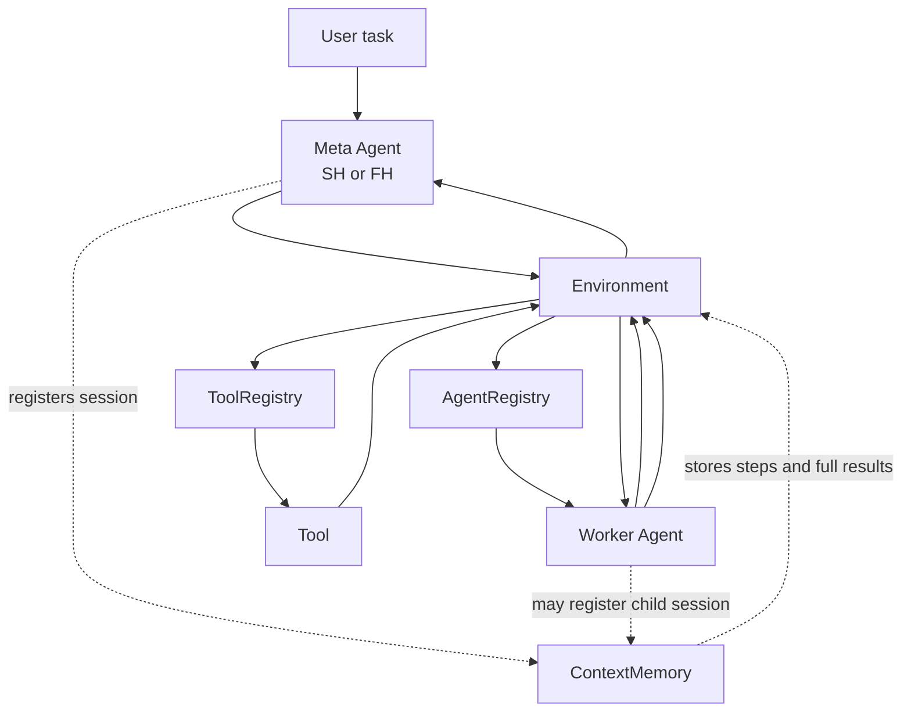
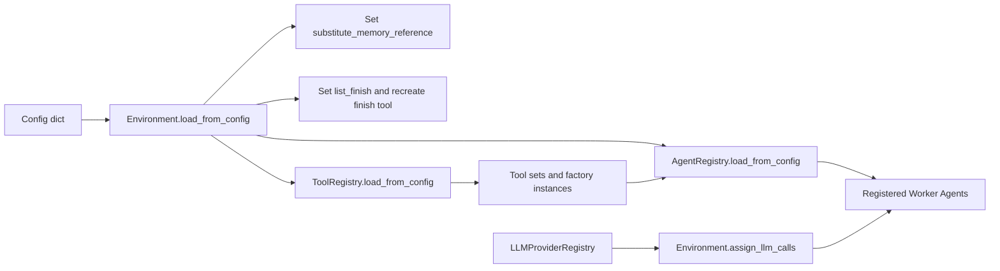
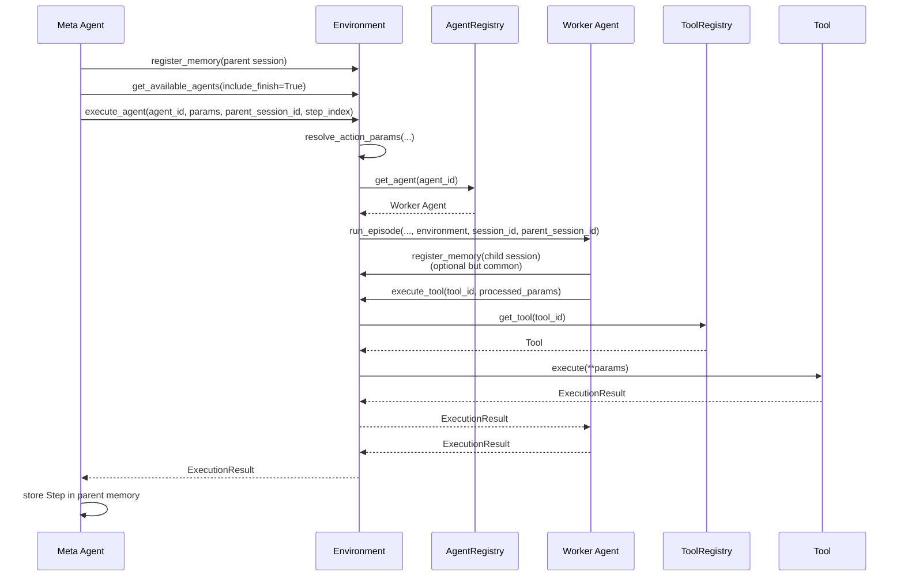
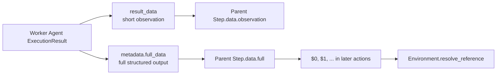

# Environment

The `Environment` is the runtime orchestration layer between Meta Agents, Worker Agents, and tools. It does not plan tasks itself. Instead, it loads registries, exposes Worker Agent schemas to Meta Agents, resolves cross-step references, routes executions, and stores session memory.

For the YAML layout and field definitions that feed the environment, see
[`configuration.md`](./configuration.md). This document focuses on how the
environment consumes that config at runtime.

## At a glance

| Area | Current behavior |
| ---- | ---------------- |
| Configuration loading | Stores raw config, updates environment flags, loads tools first, then loads agents with access to the populated `ToolRegistry` |
| Schema exposure | Returns Worker Agent schemas from `AgentRegistry` and optionally appends the synthetic `finish` tool |
| Execution routing | Dispatches `execute_agent()` to Worker Agents and `execute_tool()` to tools, with schema-based parameter checks |
| Memory registry | Stores `ContextMemory` instances by `session_id` for both Meta Agents and Worker Agents |
| Reference resolution | Resolves zero-based references such as `$0` and `$1` against `step.data["full"]` in the parent session |
| LLM wiring | Maps each registered Worker Agent to its configured LLM provider via `assign_llm_calls()` |
| Cleanup and inspection | Exposes `get_environment_info()`, `reset_memory()`, and `close()` |

## Runtime architecture

## Loading and wiring

### Startup flow

### Registry responsibilities

| Component | Stores | Notes |
| --------- | ------ | ----- |
| `ToolRegistry` | Concrete tools, tool-set-to-tool mappings, tool factory instances | Factory instances are reused by `AgentRegistry` so agents can share tool-side resources |
| `AgentRegistry` | Worker Agent instances and `agent_id -> llm_provider_id` mappings | KoPL and Atomic KB Query configs expand into one Worker Agent per tool |
| `Environment` | Config, memory sessions, finish tool, reference-substitution flags | Provides the runtime API used by Meta Agents and Worker Agents |

### What `load_from_config()` updates

| Item | Current implementation |
| ---- | ---------------------- |
| `config` | Stores the full input config for later inspection |
| `substitute_memory_reference` | Defaults to `true`; controls whether references are replaced before Worker Agent execution |
| `list_finish` | Rebuilds the synthetic `finish` tool when configured |
| Tools phase | Calls `tool_registry.load_from_config()` first |
| Agents phase | Calls `agent_registry.load_from_config(agents_config, tool_registry)` second |

## How agents interact with the environment

### End-to-end execution flow

### Division of responsibilities

| Actor | Responsibility |
| ----- | -------------- |
| Meta Agent | Chooses the next Worker Agent, calls `execute_agent()`, and stores top-level task steps in its parent `ContextMemory` |
| Environment | Validates parameters, resolves references, dispatches execution, appends timestamps, and provides access to registries and memory |
| Worker Agent | Runs its internal workflow, may create a child memory, and returns an `ExecutionResult` containing both a short observation and full structured output |
| Tool | Executes the concrete operation behind a Worker Agent step |

### Current interaction patterns by agent family

| Agent family | Environment interaction |
| ------------ | ----------------------- |
| `SHMetaAgent` | Registers a parent session, repeatedly calls `get_available_agents()` and `execute_agent()`, and stores one top-level step per action |
| `FHMetaAgent` | Registers a parent session, plans against `get_available_agents()`, executes steps through `execute_agent()`, and replans from memory when execution fails |
| KoPL Worker Agents | Register a child session and follow preprocess -> tool execution -> postprocess; return a short observation in `result_data` and the raw operator output in `metadata["full_data"]` |
| Atomic KB Query Worker Agents | Register a child session and follow preprocess -> tool execution -> postprocess; return `observation` in `result_data` and structured output plus grounded parameters in metadata |
| Husky Worker Agents | Register a child session and follow generate -> optional tool execution -> synthesis; return a short answer string in `result_data` and the final raw answer in `metadata["full_data"]` |

## Execution contract

### `execute_tool()`

| Aspect | Current behavior |
| ------ | ---------------- |
| Lookup | Retrieves the tool from `ToolRegistry`; unknown tools return a failed `ExecutionResult` |
| Parameter formats | Accepts either a dict or a positional list; list inputs are zipped against schema property order |
| Validation | Checks required parameters and rejects unexpected parameters, except internal fields such as `task_config` and `current_world_state` |
| Execution | Calls `tool.execute(**params)` |
| Error behavior | Registry and validation failures become failed `ExecutionResult`s; runtime exceptions from the tool are re-raised unless `debug=True`, in which case they are wrapped in a failed `ExecutionResult` |
| Metadata | Adds `started_at` and `ended_at` timestamps to `result.metadata` |

### `execute_agent()`

| Aspect | Current behavior |
| ------ | ---------------- |
| Lookup | Retrieves the Worker Agent from `AgentRegistry`; unknown agents return a failed `ExecutionResult` |
| Parameter formats | Accepts either a dict or a positional list; list inputs are converted using the Worker Agent schema |
| Reference handling | Calls `resolve_action_params()` before validation when a parent session is available |
| Session handling | Creates a child `session_id` using `"{agent_id}_{timestamp}"` and forwards `parent_session_id` and `step_index` |
| Call shape | Passes a bare string only for single-argument `query` or `question` schemas; otherwise passes the full parameter dict |
| Error behavior | Lookup, validation, and reference-resolution failures become failed `ExecutionResult`s; exceptions raised inside `run_episode()` propagate |
| Metadata | Adds `started_at` and `ended_at` timestamps to `result.metadata` |

### `get_available_agents()`

This method returns Worker Agent schemas from `AgentRegistry.get_openai_schema()`. When `include_finish=True`, it appends the synthetic `finish` tool generated by `create_finish_tool()`. Meta Agents plan against this combined list; raw tool schemas are not exposed here.

## Memory and reference model

### Stored objects

| Object | Stored by | Important fields | Used for |
| ------ | --------- | ---------------- | -------- |
| `ContextMemory` | Meta Agents and many Worker Agents | `session_id`, `parent_session_id`, `query`, `step_history`, `metadata` | Session-local execution history |
| Parent step | Meta Agents | `data["action"]`, `data["observation"]`, optional `data["full"]`, `metadata` | High-level planning history and future reference resolution |
| Child step | Worker Agents | Family-specific internal step data | Debugging and per-agent tracing |
| `ExecutionResult` | Tools and Worker Agents | `result_data`, `success`, `error_message`, `token_usage`, `metadata` | Contract between environment callers and callees |

### How step data is split

### Reference resolution rules

| Case | Current behavior |
| ---- | ---------------- |
| Exact reference | A value like `$0` resolves to the referenced step's `data["full"]` |
| Embedded reference | Text such as `compare $1 with $2` is substituted inline when reference substitution is enabled |
| Lists | Each list item is resolved recursively |
| Indexing | References are zero-based and must refer to an existing step in the parent session |
| Missing full data | Raises an `AgentException` when the referenced step has no `data["full"]` |
| Disabled substitution | If `substitute_memory_reference` is `false`, exact and embedded references are preserved unless forced by the caller |

## Serialization and observability

| Feature | Current behavior |
| ------- | ---------------- |
| Step logging | Meta Agents serialize steps with `step.to_dict(exclude_large_data=True)` so `data["full"]` is omitted from exported step logs |
| Environment timestamps | `execute_tool()` and `execute_agent()` append `started_at` and `ended_at` to metadata |
| Usage tracking | Worker and Meta Agents populate `execution_time`, `token_usage`, step counts, and agent-specific metadata in `ExecutionResult` |
| Environment inspection | `get_environment_info()` returns loaded config, registered tools, registered agents, active memory sessions, and object counts |

## Key implementation notes

- The environment only exposes Worker Agents plus `finish` to Meta Agents. Worker-facing tools stay behind Worker Agent implementations.
- Parent-child session links are stored in `ContextMemory`, but `$i` resolution always reads from the parent session passed to `execute_agent()`.
- The latest implementation uses `$0`-style references, not one-based indexing.
- The current step serializer drops `data["full"]` entirely when `exclude_large_data=True`; it does not emit a summary placeholder.
- `set_llm_call()` still exists for uniform injection, but the main configuration path uses `assign_llm_calls()` with provider IDs from `AgentRegistry`.
