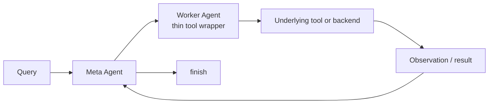
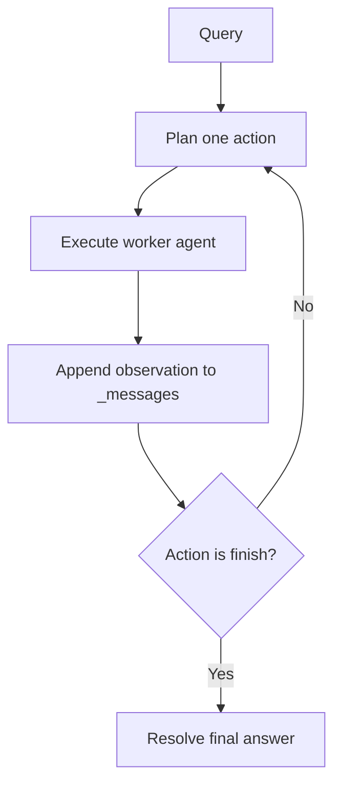
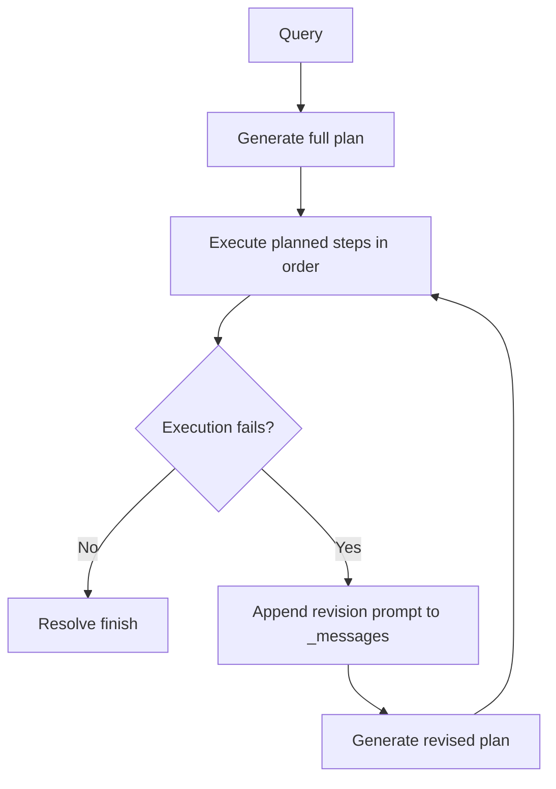

# Planner

## Overview

- The planner layer compares **planning horizons for tool calling**.
- Both planners sit between the user query and a pool of callable Worker Agents.
- Worker Agents are **thin wrappers around tool endpoints**: the meta-agent selects one callable worker entry at a time, passes arguments, and receives an observation.
- The two planner variants differ only in **when** they ask the LLM to decide those tool calls:
  - **SH (Single-step Horizon):** choose one action, execute it, observe, repeat.
  - **FH (Full-Horizon):** generate a full action sequence first, then execute it and replan only after failure.

## Shared planner behavior

### Common tool-calling flow

- Each episode starts from a string query and a fresh `ContextMemory` session.
- The planner chooses an action with an LLM, executes it through `environment.execute_agent(...)`, records the result, and stops when it reaches `finish`, `max_steps`, or the retry budget.
- Tool definitions are passed to the LLM in one of two ways:
  - as built-in function-call schemas with `use_builtin_tool_input=True`, or
  - as formatted text embedded in the prompt with `tool_formatter_id`.

### Shared state

- `ContextMemory.step_history` stores the durable execution trace.
- `Step` objects record planner-visible events.
- `$i` references let later actions or final answers refer to earlier step outputs.
- `process_finish_answer(...)` resolves those references before returning the final answer.

| `Step` field | Purpose |
|---|---|
| `step_num` | Position in the session history |
| `step_type` | Planner identifier: `sh` or `fh` |
| `status` | `PLANNED`, `COMPLETED`, or `FAILED` |
| `data` | Planner-visible payload, mainly `action` and `observation` |
| `metadata` | Execution details such as token usage, timing, and errors |

### Shared conversation transcript: `_messages`

Both planners maintain a mutable `_messages` list that serves as the live LLM transcript for planning.

- It starts with the initial system/user prompts.
- It grows with assistant outputs from planning calls.
- Invalid generations are still kept: retry feedback is appended rather than discarded.
- Execution observations, including failed tool calls or failed `finish` resolution, are appended back into the transcript.
- FH also appends revision prompts when it asks for a new plan after execution failure.
- When the LLM provider returns structured reasoning items, those items can also be preserved in the appended assistant messages.

This shared transcript is why both planners can react to earlier failures without rebuilding the prompt from scratch every time.

## SH planner

### Workflow

### How SH works

- SH runs a tight **plan → execute → observe** loop.
- Each LLM call produces exactly one next action.
- After execution, the resulting observation is appended to `_messages` and influences the next decision.
- There is no separate long-range plan object; the planner commits one step at a time.

### Action output modes

| Mode | `use_builtin_tool_output` | Behavior |
|---|---|---|
| Structured JSON | `false` | Parse one action from the response body |
| Native tool call | `true` | Read one action from `tool_calls[0]` |

### Failure and finish handling

- Worker-agent failure marks the step as `FAILED`, appends the error observation, and increments `retry_count`.
- A `finish` action is not accepted immediately; the planner first resolves any `$i` references in the answer.
- If `finish` resolution fails, SH appends the failure back into `_messages` and asks the model for a corrected next action.

### SH-specific config entry point

- `conf/meta_agent/sh.json.v1.yaml`

See [`configuration.md`](./configuration.md) for the full planner config
surface. The SH-specific runtime behavior is documented in this file; the YAML
field reference now lives in the consolidated configuration guide.

## FH planner

### Workflow

### How FH works

- FH asks the LLM for a **complete plan upfront**.
- The returned plan is a list of indexed actions, typically ending with `finish`.
- During execution, `$i` references are resolved against earlier completed steps.
- If execution succeeds, the final `finish` answer is resolved and returned.

### Replanning behavior

- FH replans only after execution failure.
- The replanning call reuses `_messages` and appends a revision prompt containing the execution history.
- The revised plan is then executed as a new attempt.
- `self._plan_history` stores the generated plans and any reasoning summaries captured from the LLM response.

### Failure and finish handling

- FH requires the plan to end with `finish`; plans without it are rejected during parsing.
- If a worker-agent step fails, FH stops the current execution attempt and requests a revised full plan.
- If `finish` resolution fails, that attempt is also treated as failed and triggers replanning.

### FH-specific config entry point

- `conf/meta_agent/fh.json.v1.yaml`

See [`configuration.md`](./configuration.md) for the full planner config
surface. The FH-specific runtime behavior is documented in this file; the YAML
field reference now lives in the consolidated configuration guide.

## SH vs FH

| Dimension | SH | FH |
|---|---|---|
| Planning unit | One next action | Full action sequence |
| LLM call timing | Before every step | Before execution, then only on replan |
| Use of `_messages` | Accumulates stepwise observations and correction feedback | Carries initial planning context plus revision prompts |
| Native tool-call output | Supported | Not supported |
| Response to failure | Try another next step | Generate a revised plan |
| Typical trade-off | More reactive, more LLM turns | Less reactive, fewer LLM turns |

## Configuration summary

Planner configs are composed through Hydra from:

- `conf/meta_agent/sh.json.v1.yaml`
- `conf/meta_agent/fh.json.v1.yaml`

See [`configuration.md`](./configuration.md) for the current planner field
reference and composition path.

## Related files

| File | Role |
|---|---|
| `src/planning/agents/meta_agents/meta_sh.py` | SH planning loop and single-action execution |
| `src/planning/agents/meta_agents/meta_fh.py` | FH upfront planning, execution, and replanning |
| `src/planning/agents/step.py` | Shared `Step` and `StepStatus` definitions |
| `src/planning/agents/llm_utils.py` | Shared prompt assembly, transcript updates, and retry helpers |
| `conf/meta_agent/sh.json.v1.yaml` | SH defaults |
| `conf/meta_agent/fh.json.v1.yaml` | FH defaults |
