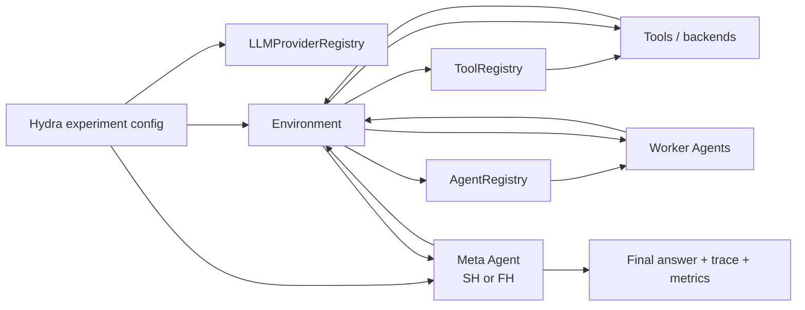
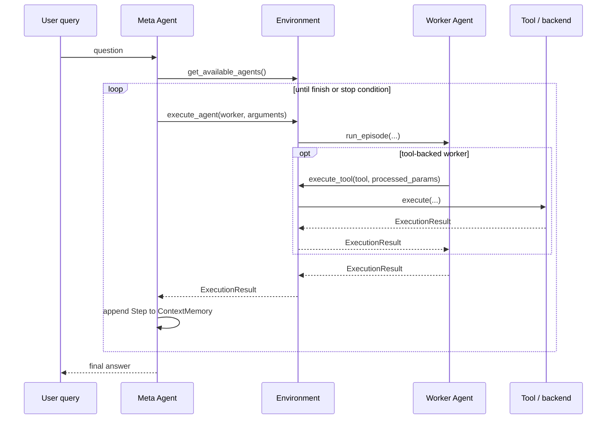
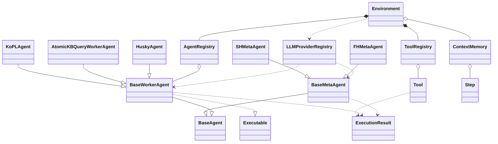

# System Design

This document is a high-level map of the framework used in the paper.
It focuses on the parts that matter for running and understanding the
**planning-horizon comparison**: the same runtime can pair either the
**SH** or **FH** planner with different Worker Agent and tool setups.

For component-level details, use the linked documents rather than this
overview:

- Environment and registries: [`environment.md`](./environment.md)
- Planners (`SH` and `FH`): [`planner.md`](./planner.md)
- Worker agents and tools: [`worker-agents-and-tools.md`](./worker-agents-and-tools.md)
- Configuration: [`configuration.md`](./configuration.md)

## Framework goal

The codebase is organized around one main experimental question:

- Hold the task environment fixed.
- Hold the available Worker Agents and tools fixed.
- Swap only the **planning horizon** at the Meta Agent layer.
- Compare outcome quality, trajectory behavior, and token cost across:
  - structured KBQA settings,
  - unstructured retrieval-based QA settings,
  - multiple LLM backbones,
  - multiple tool robustness settings.

## At a glance

| Layer | Purpose in the paper workflow | Main abstractions | Read next |
| --- | --- | --- | --- |
| Experiment composition | Select planner, dataset setting, models, and runtime options | Hydra config tree under `conf/` | [`configuration.md`](./configuration.md) |
| Planner layer | Compare planning horizons while keeping the execution backend fixed | `SHMetaAgent`, `FHMetaAgent` | [`planner.md`](./planner.md) |
| Runtime orchestration | Expose Worker Agents to the planner and route execution | `Environment`, `AgentRegistry`, `ToolRegistry` | [`environment.md`](./environment.md) |
| Worker-agent layer | Present planner-callable actions for each task setting | `BaseWorkerAgent`, KoPL workers, Atomic KB Query workers, Husky workers | [`worker-agents-and-tools.md`](./worker-agents-and-tools.md) |
| Tool layer | Execute the actual KB, retrieval, or helper operations | KoPL tools, Atomic KB Query tools, search tool | [`worker-agents-and-tools.md`](./worker-agents-and-tools.md) |
| Provider layer | Route LLM calls to the configured backend(s) | `LLMProviderRegistry` | [`configuration.md`](./configuration.md) |
| Execution trace | Store the episode trace used for replanning, analysis, and export | `ContextMemory`, `Step`, `ExecutionResult` | [`environment.md`](./environment.md), [`planner.md`](./planner.md) |

## End-to-end workflow

### Typical run sequence

1. `scripts/run.py` loads a composed Hydra experiment config.
2. The config creates:
   - one **Meta Agent** (`SH` or `FH`),
   - one **Environment**,
   - one set of **Worker Agents** and tools for the chosen task setting,
   - one **LLM provider registry**.
3. The Meta Agent sees a list of callable **Worker Agent schemas** plus the synthetic `finish` action.
4. The Meta Agent chooses actions according to its planning horizon:
   - **SH** plans one step at a time,
   - **FH** plans a full sequence, then replans only after failure.
5. The Environment routes each chosen action to the requested Worker Agent.
6. The Worker Agent performs its task-specific workflow and may call one underlying tool.
7. Results flow back as:
   - a short planner-facing observation,
   - a fuller structured result for later references and analysis.
8. The run exports final outputs such as `result.jsonl`, `memory.pkl`, and metrics.

## Runtime interaction model

### Dependency rules that stay constant across experiments

- Meta Agents do **not** call raw tools directly.
- Meta Agents plan against **Worker Agent schemas** exposed by the Environment.
- Worker Agents call tools **through the Environment**, not around it.
- The Environment owns:
  - agent/tool registries,
  - session memory,
  - cross-step reference resolution,
  - runtime dispatch.
- The planner comparison is therefore isolated to the **Meta Agent layer**.

## Class dependency map

### What the diagram means in practice

| Relationship | Why it matters |
| --- | --- |
| `SHMetaAgent` / `FHMetaAgent` inherit from `BaseMetaAgent` | The planner swap happens here while the rest of the runtime stays stable |
| Worker families inherit from `BaseWorkerAgent` | Different task settings still present a common callable interface to the planner |
| `Environment` owns the registries | The planner does not need dataset-specific loading logic |
| `ContextMemory` stores `Step` objects | Both planners can reference prior outputs and export trajectories in a uniform format |
| `ExecutionResult` is shared across tools and agents | Routing and logging use one result contract across the stack |

## Current task settings in the paper path

| Task setting | Environment config | Planner-facing worker family | Underlying tool/backend style | Primary use |
| --- | --- | --- | --- | --- |
| KoPL KBQA | `conf/env/kopl_kbqa/v1.yaml` | KoPL workers (one per operator) | KoPL operators over the KoPL KB | `KQA Pro` |
| Atomic KBQA | `conf/env/atomic_kbqa/v1.yaml` | Atomic KB Query workers (one per operator) | Freebase query tools | `GrailQA`, `WebQSP`, `GraphQ` |
| Multi-objective HotpotQA | `conf/env/multiobj/hotpotqa/v1.yaml` | Husky workers | Retrieval + synthesis / pure reasoning | `HotpotQA` |

### Why these settings share one framework

- The planner always sees the same kind of interface: **callable Worker Agents**.
- The runtime always uses the same orchestration objects: **Environment + registries + memory**.
- The dataset-specific differences live mostly in:
  - environment composition,
  - Worker Agent families,
  - underlying tools and resources,
  - prompts and grounding behavior.

## Configuration surfaces

| Question | Main config location | Notes |
| --- | --- | --- |
| Which planner is being compared? | `conf/meta_agent/` and `conf/experiment/**` | `sh` and `fh` are the canonical planner IDs |
| Which task setting is active? | `conf/env/**` | Selects Worker Agents and tools |
| Which model does the planner use? | root `model` / `meta_agent.model` | Usually composed through `conf/config.yaml` |
| Which model do workers use? | root `worker_model` / worker agent configs | Can differ from the planner model |
| Which LLM backend is used? | `llm_providers` in `conf/config.yaml` | Routed through `LLMProviderRegistry` |
| Which dataset split is evaluated? | `conf/experiment/**` | Bound under the `experiment` section |

## Key components and where to read next

| Component | Primary code entry points | Role in the framework | Details |
| --- | --- | --- | --- |
| Experiment runner | `scripts/run.py` | Batch evaluation entry point | `README.md`, `walkthrough.md` |
| Meta Agents | `src/planning/agents/meta_agents/meta_sh.py`, `meta_fh.py` | Planner-horizon comparison | [`planner.md`](./planner.md) |
| Environment | `src/planning/environment/environment.py` | Runtime orchestration and dispatch | [`environment.md`](./environment.md) |
| Agent registry | `src/planning/environment/agent_registry.py` | Build planner-visible Worker Agents from config | [`environment.md`](./environment.md) |
| Tool registry | `src/planning/environment/tool_registry.py` | Build tool sets and individual tools from config | [`environment.md`](./environment.md) |
| Worker agents | `src/planning/agents/worker_agents/` | Dataset/tool-specific execution layer | [`worker-agents-and-tools.md`](./worker-agents-and-tools.md) |
| Shared trace objects | `src/planning/agents/memory.py`, `step.py`, `executable.py` | Common memory and result contracts | [`environment.md`](./environment.md), [`planner.md`](./planner.md) |
| LLM provider routing | `src/planning/services/llm_registry.py` | Backend abstraction for planner and workers | [`configuration.md`](./configuration.md) |
| Config composition | `conf/config.yaml`, `conf/experiment/**`, `conf/env/**` | Assemble comparable runs without code changes | [`configuration.md`](./configuration.md) |

## What this document intentionally does not cover

- Planner prompt structure and failure handling details.
- Worker-family-specific preprocessing and postprocessing logic.
- Registry loading mechanics and parameter validation rules.
- Dataset preprocessing steps.

Those details live in the component-specific docs linked above. This file is only the map.
