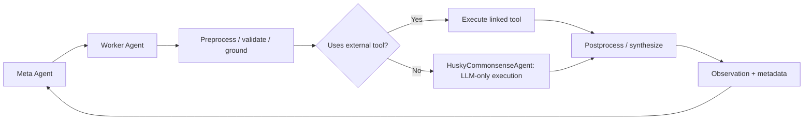
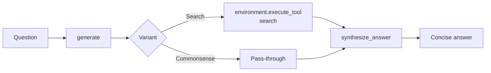

# Worker Agents and Tools

## Overview

- This document describes the **planner-facing worker-agent layer** for the paper's tool-calling setting.
- Meta agents do not call low-level tools directly. Instead, they call Worker Agents, which:
    - expose a planner-facing schema,
    - ground or validate arguments,
    - execute the linked tool or workflow, (exception: `HuskyCommonsenseAgent` does not use any external tool)
    - return a short observation string.
- In our experiments, the mapping is **one worker agent ↔ one low-level tool**.

### Family overview

| Family | Planner-facing unit | Tool (`src/planning/tools`) | Internal workflow | Input shape | Current task setting |
|---|---|---|---|---|---|
| [`KoPL`](../src/planning/agents/worker_agents/kopl_agents.py) | One agent per KoPL operator | One-to-one with `kopl/<operator>` tool IDs | `preprocess → execute → postprocess` | Dict parameters | KoPL KBQA / KQA Pro |
| [`AtomicKBQuery`](../src/planning/agents/worker_agents/atomic_kb_query_agents.py) | One agent per atomic KB operation | One-to-one with `atomic_kb_query/<operator>` tool IDs | `preprocess → execute → postprocess` | Dict parameters | Atomic KBQA / GrailQA, WebQSP, GraphQ |
| [`Husky`](../src/planning/agents/worker_agents/husky_agents.py) | One agent per variant | `search` for search variant; none for commonsense variant | `generate → execute_tool → synthesize_answer` | Natural-language question | Multi-objective HotpotQA |

## Shared worker-agent behavior

### Common execution flow



- The meta agent selects a Worker Agent action and arguments.
- The Worker Agent converts that planner action into an executable step.
- Most worker families follow a **preprocess → execute → postprocess** pattern.
- Husky agents use a closely related **generate → execute_tool → synthesize_answer** workflow.
- The returned observation is short and planner-readable; larger structured outputs are kept in execution metadata.

### Initialization and tool linkage

- Worker Agents are loaded by [`AgentRegistry`](../src/planning/environment/agent_registry.py) from `conf/worker_agent/...`.
- For **KoPL** and **AtomicKBQuery**, the registry resolves tool sets into concrete tool IDs and creates **one agent per tool**.
- Those agents usually carry `tool_ids=[tool_id]` and can copy their planner-facing schema from the linked tool with `update_schema_from_tool(...)`.
- At runtime, tool-backed workers typically call [`environment.execute_tool(...)`](../src/planning/environment/environment.py) after preprocessing.
- **HuskySearchAgent** calls the `search` tool during execution.
- **HuskyCommonsenseAgent** is the main no-tool exception: it is still a Worker Agent, but its execution stays inside the LLM workflow.

### Shared outputs ([`ExecutionResult`](../src/planning/agents/executable.py))

| Output channel | What it contains |
|---|---|
| `ExecutionResult.result_data` | Short observation string returned to the meta agent |
| `ExecutionResult.metadata.full_data` | Full structured output when the family stores it |
| `ExecutionResult.metadata.processed_params` | Grounded parameters after preprocessing |
| Worker memory steps | Internal sub-steps such as preprocess, execute, and postprocess |

## KoPL worker agents ([`kopl_agents.py`](../src/planning/agents/worker_agents/kopl_agents.py))

### Purpose

- KoPL worker agents execute individual KoPL operators over a KoPL-formatted knowledge base.
- Each planner-visible action corresponds to one operator such as `find`, `relate`, `filter_str`, or `count`.
- They are used in the **KoPL KBQA** setting, with **KQA Pro** as the primary benchmark.

### Agent classes and linked tools

The grouping below mirrors the tool grouping in [`src/planning/tools/kopl_tools.py`](../src/planning/tools/kopl_tools.py).

| Worker agent class | Preprocessing focus | Linked KoPL tools |
|---|---|---|
| `KoPLAgent` | Pass-through / schema-free | `find_all`, `and`, `or`, `query_name`, `count`, `query_relation`, `verify_str`, `verify_num`, `verify_year`, `verify_date` |
| `KoPLFindFilterConceptAgent` | Entity or concept grounding | `find`, `filter_concept` |
| `KoPLKeyOnlyAgent` | Attribute or relation key grounding | `relate`, `query_attr`, `select_between`, `select_among` |
| `KoPLKeyValueAgent` | Key, value, and qualifier grounding | `filter_str`, `filter_num`, `filter_year`, `filter_date`, `qfilter_str`, `qfilter_num`, `qfilter_year`, `qfilter_date`, `query_attr_under_condition`, `query_attr_qualifier`, `query_relation_qualifier` |

### Execution pattern


- `KoPLAgentFactory` creates operator-specific workers.
- Each worker executes exactly one operator.
- Preprocessing varies by class:
    - `KoPLAgent`: mostly pass-through.
    - `KoPLFindFilterConceptAgent`: entity/concept grounding.
    - `KoPLKeyOnlyAgent`: relation or attribute key grounding.
    - `KoPLKeyValueAgent`: key-value or qualifier grounding.
- Specialized subclasses use embeddings and, when enabled, LLM schema matching to map natural-language strings to KB entries.
- Execution calls `environment.execute_tool("kopl/<operator>", params)`.
- Postprocessing converts the tool output into a concise observation and preserves the full data for later inspection.

### Inputs and outputs

| Item | Description |
|---|---|
| Input | Dict of operator parameters. The planner typically passes `$i` references for prior entity tuples, plus natural-language names, keys, or values that may need grounding. |
| Output | Short observation such as a result count, entity summary, or scalar value. Full structured data is stored in metadata. |

### Representative examples

```text
find[{"name": "Pittsburgh"}]
```

```text
filter_str[{"entities_and_facts": "$1", "key": "location", "value": "Pennsylvania"}]
```

### Configuration and key files

| Config file path | Role |
|---|---|
| `conf/worker_agent/kopl/base.v1.yaml` | Base KoPL agents for schema-free operators |
| `conf/worker_agent/kopl/find_and_filter_concept.v1.yaml` | `find` and `filter_concept` workers |
| `conf/worker_agent/kopl/key_only.v1.yaml` | Key-only grounding workers |
| `conf/worker_agent/kopl/key_and_value.v1.yaml` | Key-and-value grounding workers |

| File | Role |
|---|---|
| `src/planning/agents/worker_agents/kopl_agents.py` | KoPL worker classes and `KoPLAgentFactory` |
| `src/planning/tools/kopl_tools.py` | Low-level KoPL tool factories and operator grouping |

### Notes and boundaries

- KoPL workers are tool wrappers, not planners.
- Embedding-based grounding depends on precomputed resources under `data/kopl_kbqa/kqa_pro/embeddings/`.
- When `strict_mode=True`, workers require exact matches and skip fuzzy grounding.

## AtomicKBQuery worker agents

### Purpose

- AtomicKBQuery workers execute single compositional Freebase operations.
- They support the **Atomic KBQA** setting used for **GrailQA**, **WebQSP**, and **GraphQ**.
- Each worker corresponds to one low-level atomic query tool and contributes one step to a growing compositional query.

### Agent-to-tool mapping

| Worker agent class | Planner-facing agent | Linked tool ID | Logical role |
|---|---|---|---|
| `ExtractEntityAgent` | `extract_entity` | `atomic_kb_query/extract_entity` | `START` |
| `FindRelationAgent` | `find_relation` | `atomic_kb_query/find_relation` | `JOIN` |
| `MergeAgent` | `merge` | `atomic_kb_query/merge` | `AND` |
| `OrderAgent` | `order` | `atomic_kb_query/order` | `ARGMAX` / `ARGMIN` |
| `CompareAgent` | `compare` | `atomic_kb_query/compare` | `CMP` |
| `TimeConstraintAgent` | `time_constraint` | `atomic_kb_query/time_constraint` | `TC` |
| `CountAgent` | `count` | `atomic_kb_query/count` | `COUNT` |

### Execution pattern


- All concrete classes extend `AtomicKBQueryWorkerAgent`.
- Preprocessing usually does two things:
    - extracts `function_list` state from referenced earlier steps, and
    - grounds entities or relations using embeddings and optional LLM schema matching.
- Execution calls the linked `atomic_kb_query/<operator>` tool.
- Postprocessing returns either:
    - an entity-style observation with labels, or
    - a scalar observation such as `Count: 4`.
- The updated `function_list` is stored in metadata and carried forward across steps.

### Inputs and outputs

| Item | Description |
|---|---|
| Input | Dict parameters with operation-specific fields. `$i` references are used to recover previous `function_list` state or entity results. |
| Output | Observation string for the planner plus structured output and updated `function_list` in metadata. |

### Representative examples

```text
extract_entity[{"input_value": "Barack Obama"}]
```

```text
find_relation[{"relation": "government.politician.party", "target_ref": "$0"}]
```

### Configuration and key files

| Config file path | Role |
|---|---|
| `conf/worker_agent/atomic_kb_query.v1.yaml` | Shared AtomicKBQuery worker configuration |

| File | Role |
|---|---|
| `src/planning/agents/worker_agents/atomic_kb_query_agents.py` | Atomic worker classes and factory |
| `src/planning/tools/atomic_kb_query_tools.py` | Low-level atomic query tools |

### Notes and boundaries

- These workers are dataset-agnostic; dataset-specific candidates and settings come through `task_config`.
- Shared schema resources and embedding models are loaded lazily and cached.
- When `strict_mode=True`, relation grounding falls back to exact matching only.

## Husky worker agents

### Purpose

- Husky workers are fixed-workflow agents for the **multi-objective HotpotQA** setting.
- Current experiments primarily use:
    - `HuskyCommonsenseAgent`
    - `HuskySearchAgent`
- They are less tool-wrapper-like than the KBQA families, but they serve the same planner-facing role: one callable worker action that returns a concise observation.

### Variant overview

| Worker agent class | External tool usage | Notes |
|---|---|---|
| `HuskyCommonsenseAgent` | None | Pure LLM reasoning; main no-tool exception |
| `HuskySearchAgent` | `search` | Generates a query, executes search, then synthesizes an answer |

### Execution pattern



- All Husky variants use a fixed single-pass workflow:
    - `generate()`
    - `execute_tool()`
    - `synthesize_answer()`
- `HuskyCommonsenseAgent` keeps execution inside the LLM pipeline.
- `HuskySearchAgent` turns the question into a search query, calls the `search` tool, and synthesizes the answer from retrieved content.

### Inputs and outputs

| Item | Description |
|---|---|
| Input | A natural-language question. At runtime Husky workers expect a string query. |
| Output | A concise answer string returned to the planner, typically wrapped as `Found the answer: ...`. |

### Representative examples

```text
husky_commonsense_agent[{"question": "What currency is used in Thailand?"}]
```

```text
husky_search_agent[{"question": "Who directed the film Inception?"}]
```

### Configuration and key files

| Config file path | Role |
|---|---|
| `conf/worker_agent/husky/commonsense.v1.yaml` | Prompts and model settings for `HuskyCommonsenseAgent` |
| `conf/worker_agent/husky/search.v1.yaml` | Prompts and model settings for `HuskySearchAgent` |

| File | Role |
|---|---|
| `src/planning/agents/worker_agents/husky_agents.py` | Husky base class and concrete variants |
| `src/planning/tools/search_tool.py` | Search tool used by `HuskySearchAgent` |

### Notes and boundaries

- `HuskyMathAgent` and `HuskyCodeAgent` exist in the codebase but are not currently supported in this repository's experiment workflows.
- Husky workers do not follow the same one-agent-per-tool pattern as strictly as KoPL and AtomicKBQuery.
- `HuskyCommonsenseAgent` is the clearest exception to the paper's tool-wrapper framing because it performs pure LLM reasoning.

## Configuration summary

See [`configuration.md`](./configuration.md) for the consolidated config
reference, including how `conf/env/**` composes the worker-agent fragments in
`conf/worker_agent/**`.
